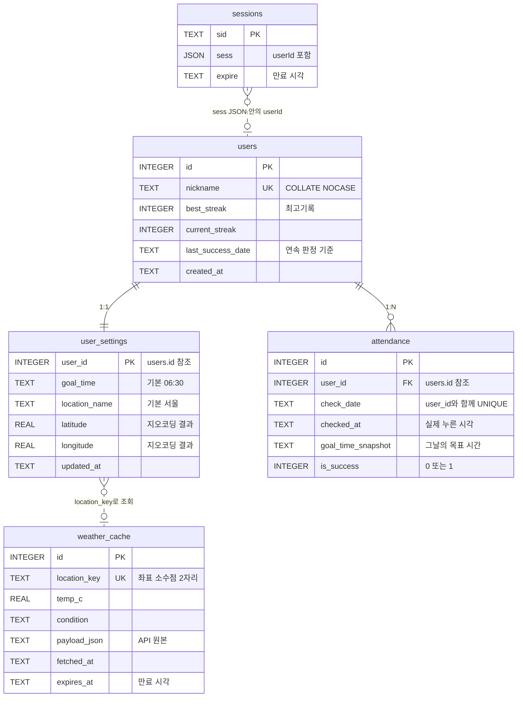

# 오늘도 하루를 시작해볼까요?

기상 후 출석체크 앱. 목표 시간 안에 출석하면 연속 기록(스트릭)이 쌓이고, 닉네임별로 최고기록 랭킹을 볼 수 있습니다.

## 실행

```bash
npm install
cp .env.example .env
npm run initdb
npm start
```

http://localhost:3000

## 스크립트

| 명령 | 하는 일 |
|---|---|
| `npm start` | 서버 실행 |
| `npm run start:prod` | 스키마 적용 후 서버 실행 (컨테이너 시작 명령) |
| `npm run dev` | 파일 변경 시 자동 재시작 |
| `npm run initdb` | `db/schema.sql`을 DB에 적용 (여러 번 실행해도 안전) |
| `npm test` | 전체 검증 (스트릭 + 인증) |
| `npm run test:streak` | 스트릭 로직만 |
| `npm run test:auth` | 인증만 (별도 포트 3999에 서버를 띄워 확인) |

테스트는 `data/test.db`, `data/test-auth.db`를 따로 만들어 쓰므로 실제 DB를 건드리지 않습니다.

## 구조

```
db/schema.sql      테이블·뷰 정의
src/db.js          DB 연결, PRAGMA, 로컬 시간 포맷
src/initdb.js      스키마 적용
src/session.js     세션 쿠키 (express-session + SQLite 스토어)
src/attendance.js  출석 체크 + 스트릭 갱신 (트랜잭션)
src/geocode.js     위치 이름 -> 좌표 (Nominatim)
src/weather.js     Open-Meteo 호출 + 캐시
src/routes.js      REST API
src/server.js      Express 서버
public/sky.js      시각에 따라 배경 하늘을 고른다
public/            화면 (빌드 도구 없는 순수 HTML/CSS/JS)
test/streak.mjs    스트릭 로직 테스트
test/auth.mjs      인증 테스트
Dockerfile         이미지 빌드 (네이티브 모듈 + tzdata)
fly.toml           Fly.io 설정 (볼륨, 리전, TZ)
```

## 데이터베이스

SQLite 파일 하나(`data/haru.db`)에 테이블 5개와 뷰 2개.



실선은 외래키, 점선은 외래키 없는 논리적 연결입니다.

| 테이블 | 역할 |
|---|---|
| **users** | 닉네임(신원) + 스트릭. 최고기록을 여기 들고 있습니다 |
| **user_settings** | 목표 시간, 날씨 위치. users와 1:1이라 `user_id`가 곧 PK |
| **attendance** | 하루 1행. `UNIQUE (user_id, check_date)`로 중복 출석 차단 |
| **weather_cache** | 위치별 1행. 여러 사용자가 같은 도시면 한 행을 공유합니다 |
| **sessions** | 세션 스토어가 만들고 관리. `db/schema.sql`에는 없습니다 |

### 점선 관계 두 개

**`sessions` → `users`** — 사용자 id가 `sess` JSON 문자열 **안에** 있어서 SQLite가 강제할 수 있는 관계가 아닙니다. 그래서 `users` 행을 지워도 세션 행에 `ON DELETE CASCADE`가 걸리지 않습니다. 죽은 세션이 남지만, 다음 요청에서 사용자를 못 찾으면 401을 돌려줍니다([src/routes.js](src/routes.js)의 `me()`). 만료된 세션은 스토어가 15분마다 청소합니다.

**`user_settings` → `weather_cache`** — 캐시는 사용자가 아니라 **위치**에 속한 데이터입니다. `location_key`(좌표를 소수점 2자리로 깎은 문자열)로 조회할 뿐 관계가 아닙니다.

### 뷰 2개

**`v_recent_3days`** — 최근 3일을 `success` / `fail` / `absent` 세 상태로 돌려줍니다. `LEFT JOIN`이라 출석하지 않은 날도 빈 줄로 나옵니다.

**`v_leaderboard`** — `best_streak > 0`인 사람만 보여줍니다. `WHERE`가 윈도우 함수보다 먼저 평가되므로 걸러낸 뒤 1위부터 번호가 붙습니다. 동점자는 `RANK()`로 나란히 같은 순위입니다.

### sessions는 왜 schema.sql에 없나

`better-sqlite3-session-store`가 서버 시작 시 알아서 만듭니다. 라이브러리가 테이블 모양을 바꿀 수 있으니 직접 정의하지 않는 편이 안전합니다.

그 대가로 **`npm run initdb` 직후에는 테이블이 4개고, 서버를 한 번 띄우면 5개가 됩니다.** DB를 열어보고 혼란스럽지 않도록 `db/schema.sql`에도 주석으로 적어뒀습니다.

### 성공 조건

목표 시간이 06:30일 때, 출석을 받는 창은 **03:30 ~ 06:30**입니다.

| 누른 시각 | 결과 |
|---|---|
| 03:29 이전 | 거절 (기록 남지 않음) |
| 03:30 | 성공 (하한 경계 포함) |
| 06:30 | 성공 (목표 경계 포함) |
| 06:31 이후 | 실패 — 연속 기록 끊김 |

**하한선은 목표 시간 −3시간입니다.** 밤을 새운 사람이 00:30에 눌러 성공을 챙기는 걸 막습니다. 목표를 05:00으로 당기면 하한도 02:00으로 함께 당겨집니다. `.env`의 `EARLY_CHECKIN_WINDOW_MINUTES`로 조절합니다.

**너무 이른 체크인은 실패로 기록하지 않고 거절합니다.** 하루 한 행(`UNIQUE`) 제약 때문에 여기서 행을 만들면 정작 아침에 진짜 출석을 못 하게 됩니다.

**유예 시간은 없습니다.** 06:31은 곧바로 실패입니다. 느슨하게 하려면 목표 시간 자체를 늦추면 됩니다.

**주말 예외는 없습니다.** 토·일에 안 누르면 스트릭이 끊깁니다.

목표가 03:00처럼 이르면 하한이 자정을 넘어가는데, 날짜가 걸쳐지는 걸 피하려고 그 경우엔 00:00으로 자릅니다.

### 설계에서 짚어둘 점

**`attendance.goal_time_snapshot`** — 그날 적용된 목표 시간을 행에 복사해 둡니다. 나중에 목표를 06:30에서 07:00으로 바꿔도 과거 기록의 성공/실패 판정이 뒤집히지 않습니다.

**출석 창은 서버가 계산해서 내려줍니다** — `GET /api/me`의 `checkin_window`(`{ earliest, goal }`)가 화면 안내에 그대로 쓰입니다. 예전에는 프론트엔드가 하한선을 직접 계산했는데, `EARLY_CHECKIN_WINDOW_MINUTES`를 바꾸면 판정은 새 값을 따르고 안내만 180분을 그대로 보여줬습니다.

**`npm run initdb`는 기존 DB도 맞춰 줍니다** — `CREATE TABLE IF NOT EXISTS`는 이미 있는 테이블을 건드리지 않아서, 컬럼을 지울 때는 따로 처리해야 합니다. 쓰지 않던 `attendance.weather_summary`를 뺄 때 `ALTER TABLE ... DROP COLUMN`을 `src/initdb.js`에 넣었습니다.

**스트릭에 결석 처리 로직이 없습니다** — `last_success_date`가 '어제'가 아니면 `current_streak`이 1부터 다시 시작합니다. 하루라도 비면 자동으로 끊기므로 결석을 따로 기록하거나 배치로 훑을 필요가 없습니다.

**`PRAGMA foreign_keys`는 연결마다 켜야 합니다** — `journal_mode = WAL`은 DB 파일에 저장되지만 `foreign_keys`는 연결에만 적용됩니다. 안 켜면 잘못된 `user_id`가 **에러 없이 조용히** 들어갑니다. `src/db.js`에서 처리합니다.

**날씨 캐시는 만료된 값도 씁니다** — API가 죽거나 인터넷이 끊기면 `expires_at`이 지난 캐시라도 보여줍니다(`source: 'stale'`).

## 배경 — 여는 시각의 하늘

기상 시간 앱이라 배경이 지금 시각의 하늘을 따라갑니다. 이미지도 라이브러리도 쓰지 않고 CSS 그라데이션만 씁니다.

| 시간대 | 하늘 | 카드 |
|---|---|---|
| 04:00~07:00 | 여명 — 남색에서 복숭아색으로 | 어둡게 |
| 07:00~11:00 | 아침 — 맑은 하늘색 | 밝게 |
| 11:00~17:00 | 낮 — 옅은 하늘색 | 밝게 |
| 17:00~22:00 | 황혼 — 자주색에서 주황색으로 | 어둡게 |
| 22:00~04:00 | 밤 — 짙은 남색 | 어둡게 |

목표 시간대(기본 06:30)가 **여명**에 들어갑니다. 해가 아직 안 뜬 하늘을 보면서 출석을 누르게 됩니다.

`public/sky.js`가 `<html>`에 `data-sky` 속성을 붙이고, CSS가 그 값에 따라 변수만 갈아끼웁니다. 색을 쓰는 규칙은 한 군데도 고칠 필요가 없습니다. 첫 페인트 전에 색이 정해지도록 `<head>`에서 동기적으로 실행합니다 — `body` 끝에서 실행하면 기본값이 한 번 번쩍입니다. 화면을 켜둔 채로도 시간대가 넘어가게 60초마다 다시 확인합니다.

### 어두운 하늘에서 카드도 어둡게 하는 이유

여명과 황혼 그라데이션은 **아래쪽이 밝아집니다**(복숭아색, 주황색). 카드를 반투명 흰색으로 두면 그 위에서 흰 글씨가 안 보입니다. 그래서 어두운 시간대에는 카드를 짙은 남색 반투명(`rgba(14, 18, 42, 0.58)`)으로 둡니다. 배경이 밝든 어둡든 글씨가 읽힙니다.

5개 시간대 전부 본문·보조 글씨·버튼이 WCAG AA(4.5:1)를 넘습니다. 이 과정에서 원래 쓰던 초록색 `#1d9e75`가 흰 글씨와 3.39:1로 기준에 못 미친다는 걸 발견해서 `#15805e`(4.91:1)로 한 단계 어둡게 잡았습니다.

## 인증 — 기기 바인딩

**비밀번호가 없습니다.** 닉네임을 정하면 서버가 세션을 만들고 httpOnly 쿠키를 내려줍니다. 그 쿠키가 신원의 전부입니다.

- 쿠키를 지우거나 다른 기기에서 열면 **그 기록에 다시 접근할 수 없습니다.** 되찾을 방법이 없습니다(설계상 의도)
- 세션 id 생성, 쿠키 서명, 만료는 직접 만들지 않고 `express-session`에 맡깁니다
- 세션은 `better-sqlite3-session-store`로 같은 SQLite 파일에 저장되므로 서버를 재시작해도 유지됩니다

**닉네임은 선점 방식입니다.** 이미 쓰는 닉네임으로 가입하면 409로 거절합니다. 이게 없으면 닉네임만 아는 사람이 그 계정이 되어 기록을 가져갈 수 있습니다.

이미 이 기기에 기록이 있는 상태에서 `/api/signup`을 부르면 새로 만들지 않고 기존 기록을 돌려줍니다. 세션을 새 사용자로 갈아타면 이전 기록이 주인 없이 남아 영구히 사라지기 때문입니다.

닉네임을 바꾸고 싶을 때는 `PUT /api/me/nickname`으로 **이름만** 바꿉니다. 기록은 그대로 유지됩니다. 그래서 기록을 잃는 로그아웃 버튼은 두지 않았습니다.

## 위치 설정

위치 이름만 입력하면 서버가 좌표를 찾아옵니다. 좌표를 직접 입력할 필요가 없습니다.

지오코딩은 **OpenStreetMap Nominatim**을 씁니다. Open-Meteo의 지오코딩을 먼저 시도했지만 한글이 신뢰할 수 없었습니다. `서울`과 `제주`는 결과가 없고 `부산`은 경북의 작은 마을이 1순위로 나왔습니다. Nominatim은 `서울`, `부산`, `제주`, `강남구` 모두 정확합니다.

Nominatim은 커뮤니티 서비스이고 이용 정책(User-Agent 명시, 초당 1회 이하)이 있습니다. 사용자가 위치를 바꿀 때만 호출하므로 개인용 규모에서는 문제없지만, 사용자가 많아지면 유료 지오코더로 갈아타야 합니다.

## API

인증이 필요한 경로는 쿠키가 없으면 401을 돌려줍니다.

| 메서드 | 경로 | 인증 | 설명 |
|---|---|---|---|
| POST | `/api/signup` | — | 닉네임 선점 + 세션 생성. 중복이면 409 |
| GET | `/api/me` | 필요 | 내 정보 + 설정 + 오늘 출석 상태 + 출석 창 |
| PUT | `/api/me/nickname` | 필요 | 닉네임만 변경 (기록 유지) |
| PUT | `/api/me/settings` | 필요 | 목표 시간, 날씨 위치 변경 |
| POST | `/api/me/attendance` | 필요 | 오늘 출석 체크 |
| GET | `/api/me/recent` | 필요 | 최근 3일 |
| GET | `/api/me/weather` | 필요 | 날씨 (캐시 우선) |
| GET | `/api/leaderboard` | — | 최고기록 순위 (공개) |

경로에 사용자 id가 없습니다. 예전에는 `/api/users/:id`였는데 아무 id나 넣으면 남의 기록이 그대로 나왔습니다(IDOR). 지금은 항상 세션의 사용자만 봅니다.

## 환경 변수

`.env.example`을 `.env`로 복사해서 씁니다. `.env`는 `.gitignore`에 있습니다.

**`SESSION_SECRET`이 진짜 비밀값입니다.** 쿠키 서명에 쓰이며, 이 값이 바뀌면 모든 사용자의 쿠키가 무효가 되고 기기 바인딩이라 기록을 되찾을 수 없습니다. 없거나 32자보다 짧으면 서버가 새 값을 만들어 알려주고 종료합니다.

새로 만들기:

```bash
node -e "console.log(require('crypto').randomBytes(32).toString('hex'))"
```

`NODE_ENV`와 `TZ`는 `.env`에 없습니다. 배포에서만 필요하고 `Dockerfile`과 `fly.toml`이 넣어 줍니다. 로컬에서는 둘 다 없는 게 정상입니다 — `NODE_ENV`가 없으면 `secure` 쿠키가 꺼지고(localhost는 http라 켜면 로그인이 안 됩니다), `TZ`는 OS 설정을 씁니다.

날씨(Open-Meteo)와 지오코딩(Nominatim)은 API 키가 필요 없습니다. 키가 필요한 API로 갈아타면 `WEATHER_API_KEY`를 `.env`에 넣고 `src/weather.js`의 URL 조립 부분만 고치면 됩니다.

## 배포 — Fly.io

SQLite 파일을 볼륨에 그대로 얹습니다. Postgres로 갈아타지 않으므로 `COLLATE NOCASE`, `GLOB`, `AUTOINCREMENT`, 동기 트랜잭션 같은 SQLite 고유 문법을 한 줄도 고칠 필요가 없습니다.

| 파일 | 하는 일 |
|---|---|
| `Dockerfile` | 이미지 빌드. 네이티브 모듈을 컨테이너 안에서 컴파일하고 `tzdata`를 넣습니다 |
| `.dockerignore` | `node_modules`, `data/`, `.env`를 이미지에서 뺍니다 |
| `fly.toml` | 리전, 볼륨 마운트, 환경 변수, 머신 크기 |

### 타임존이 제일 중요합니다

Fly 머신은 UTC로 돕니다. 이 앱은 로컬 시간 기준으로 날짜와 성공을 판정하므로(`getHours()`, SQLite `date('now','localtime')`) 그대로 두면 조용히 망가집니다.

목표 06:30에 정확히 출석했을 때:

| TZ | check_date | checked_at | 판정 |
|---|---|---|---|
| `Asia/Seoul` | 2026-03-02 | 2026-03-02 06:30:00 | 성공 |
| `UTC` | 2026-03-01 | 2026-03-01 21:30:00 | **실패** |

UTC에서는 21:30이 목표 06:30을 넘겼다고 계산되어 **매일 실패로 기록되고 스트릭이 끊깁니다.** 에러도 안 나고 로그에도 안 남습니다. [src/db.js](src/db.js)의 `localDateTime()` 주석이 걱정하던 상황이 배포하면 현실이 됩니다.

대응 두 가지가 **한 쌍**입니다. `fly.toml`의 `TZ = "Asia/Seoul"`만으로는 부족하고, `node:24-slim`에 `tzdata`가 없어서 `Dockerfile`에서 설치해야 합니다. 하나라도 빠지면 위 표의 UTC 행이 됩니다.

### 머신은 1대여야 합니다

Fly 볼륨은 머신 한 대에만 붙습니다. 2대로 늘리면 두 번째 머신은 빈 볼륨을 보고 **별개의 DB를 만듭니다.** 사용자가 요청마다 다른 기록을 보게 됩니다. 배포 후 `flyctl scale count 1`로 확인합니다.

그 대가로 **배포할 때마다 짧은 다운타임이 있고, 호스트 장애 시 앱이 내려갑니다.** Fly 문서는 볼륨을 2개 이상 두라고 권하지만 순수 SQLite로는 불가능합니다 — 그 답은 LiteFS인데 이 규모에 과합니다. 자동 스냅샷이 기본 5일 보관되지만 Fly도 자체 백업을 따로 하라고 명시합니다. 기기 바인딩이라 기록을 되찾을 방법이 없다는 점과 겹치므로, **볼륨이 날아가면 전부 사라집니다.**

### 스키마는 부팅 때 적용합니다

`[deploy] release_command`를 쓰면 안 됩니다. **릴리스 커맨드 머신에는 볼륨이 붙지 않아서** 빈 임시 디스크에 테이블을 만들고 버려집니다.

그래서 `npm run start:prod`(= `initdb` 후 `server`)를 컨테이너 시작 명령으로 씁니다. `initdb`는 여러 번 실행해도 안전하므로 매 부팅 실행에 문제가 없습니다.

### 쿠키 설정 두 개가 짝입니다

배포하면 HTTPS로 나가므로 `secure` 쿠키를 씁니다. 그런데 Fly는 엣지에서 TLS를 끊고 내부로는 http로 넘기기 때문에, `app.set('trust proxy', 1)`이 없으면 express-session이 요청을 http로 보고 **쿠키를 아예 안 내려줍니다.** 로그인이 조용히 안 되는 형태라 둘은 항상 같이 켜야 합니다. `NODE_ENV=production`이 둘 다를 켭니다.

| 요청 | Set-Cookie |
|---|---|
| `X-Forwarded-Proto: https` | `HttpOnly; Secure; SameSite=Lax` |
| 평문 http | 없음 |

### npm 11의 install 스크립트 차단

`package.json`에 `allowScripts`로 `better-sqlite3`를 허용해 두었습니다. npm 11은 의존성의 install 스크립트를 기본 차단하는데, `better-sqlite3`는 그 스크립트(`prebuild-install || node-gyp rebuild`)로 네이티브 바이너리를 만듭니다. 막히면 **`npm ci`는 성공하고 런타임에 죽습니다.**

`--allow-scripts` CLI 플래그는 프로젝트 설치에서 거부되므로(`EALLOWSCRIPTS`) `package.json`에 적는 것만 방법입니다. 배열이 아니라 객체 형식만 인식됩니다.

`engines`를 추가하면 `package-lock.json`도 함께 갱신해야 합니다. 락파일이 루트의 `engines`까지 기록하기 때문에, 안 맞으면 빌드에서 `npm ci`가 "not in sync"로 실패합니다.

### 배포 순서

```bash
flyctl launch --no-deploy
flyctl secrets set SESSION_SECRET=$(node -e "console.log(require('crypto').randomBytes(32).toString('hex'))")
flyctl deploy
flyctl scale count 1
```

`SESSION_SECRET`은 `fly.toml`의 `[env]`가 아니라 **secrets로** 넣습니다. `fly.toml`은 커밋되는 파일입니다. 그리고 **한 번 정하면 바꾸지 않습니다** — 바뀌면 모든 쿠키가 무효가 되고, 기기 바인딩이라 기록을 되찾을 수 없습니다.

### 배포 후 확인

```bash
flyctl ssh console -C "date"
flyctl ssh console -C "ls -la /data"
```

`date`에 `KST`가 찍혀야 합니다. `haru.db`가 `/data`가 아니라 `/app/data/`에 있으면 `DB_PATH`가 안 먹은 것이고, 재배포하면 기록이 날아갑니다.

브라우저에서:

- 쿠키에 `Secure`와 `HttpOnly`가 둘 다 붙었는지
- 출석 창 안내가 `03:30 ~ 06:30`으로 나오는지 (TZ와 `checkin_window`를 한 번에 확인합니다)
- **머신을 재시작한 뒤 기록이 남아 있는지** (`flyctl machine restart <id>`) — 볼륨이 실제로 동작하는지 보는 유일한 테스트입니다

## 사용한 것

Express 5, better-sqlite3, express-session, better-sqlite3-session-store, dotenv, Open-Meteo, Nominatim. 모두 무료입니다.

세션은 직접 만들지 않고 `express-session`을 씁니다. 비밀번호를 받지 않으므로 해싱 라이브러리는 필요 없습니다.
