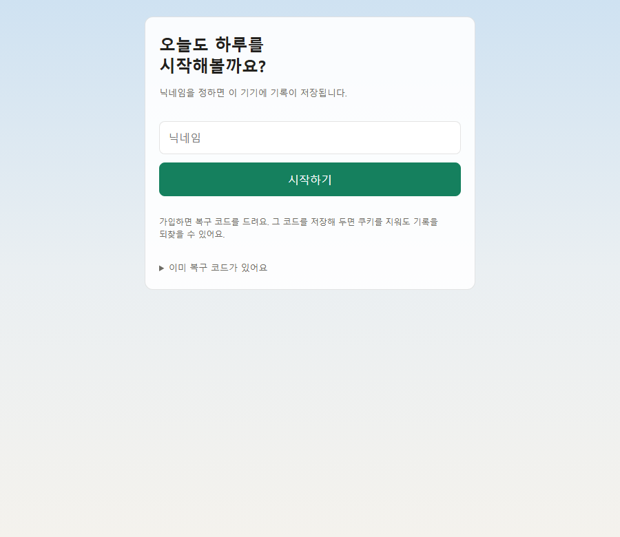
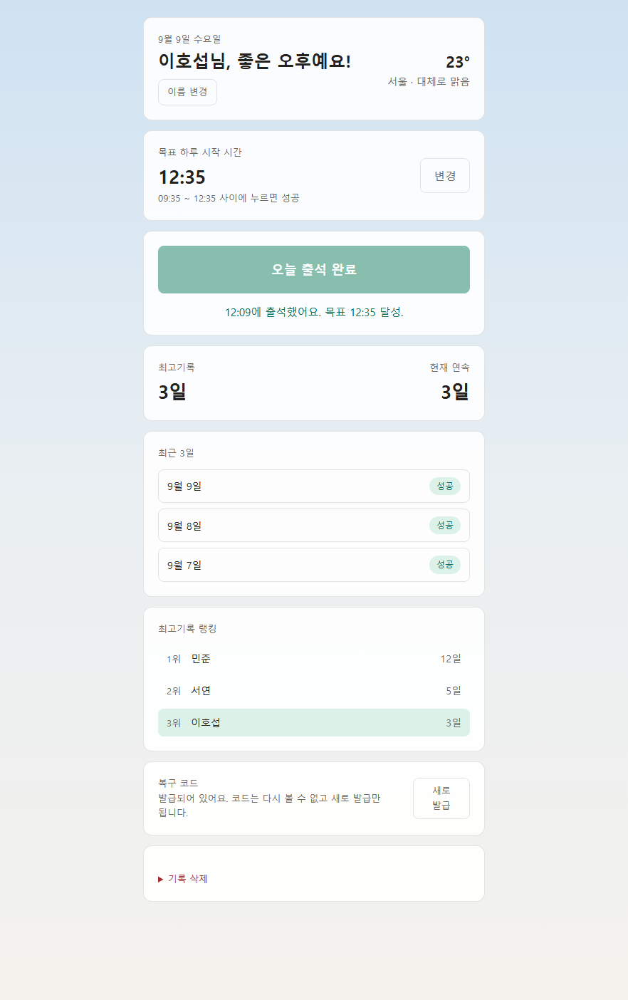
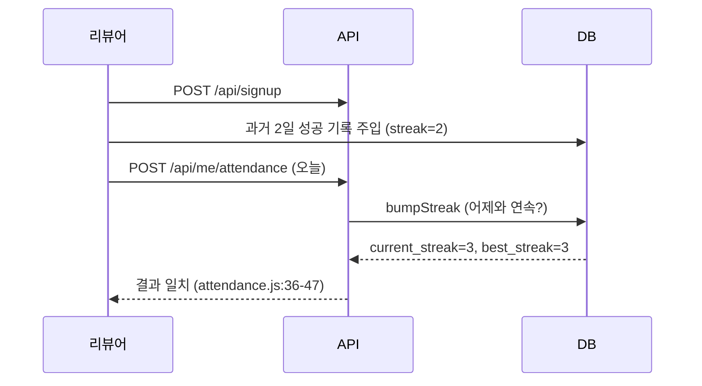

# AIFFEL Campus Code Peer Review

- **코더**: 김현지 · **리뷰어**: 이호섭
- **대상**: [hojitea-ui/backend_homework](https://github.com/hojitea-ui/backend_homework) `7e897bd` · 배포 <https://haru-checkin.fly.dev>
- **환경**: Windows 11, Node v24.19.0

> PRT 5번은 파이썬(PEP8) 기준이라, Node.js 프로젝트에 맞게 **JS 관례(모듈 분리·중복 최소화·함수화)** 로 바꿔 판정했습니다.

## 총평 (한 줄 요약)

| 항목 | 판정 | 핵심 근거 |
|---|:---:|---|
| 1. 완성도 | ✅ | 로컬·배포 모두 동작, 테스트 60건 전부 통과 |
| 2. 코드 이해도 | ✅ | 주석이 "왜"만 설명 — 코드로 알 수 있는 건 안 씀 |
| 3. 디버깅/실험 기록 | ✅ | IDOR 자가 발견·수정, 지오코딩 교체 기록 |
| 4. 회고 | ✅ | 배운점·설계 변경·남은 고민 3층 구조 + 고민을 커밋으로 해결 |
| 5. 간결성/효율 | ✅ | 8개 모듈 역할 분리, prepared statement 재사용, 트랜잭션 |

---

## 1. 완성된 코드가 제출되었나요? — ✅

- **동작 확인**: README 절차 그대로 `npm install → npm run initdb → npm start` → 가입~랭킹 전 과정 정상.





시간대별 인사말, 외부 API 날씨(`서울 · 대체로 맑음 23°`), 출석 창(`09:35~12:35`), 스트릭, 랭킹, 복구 코드 상태까지 한 화면에 모두 확인됩니다. 배포본(<https://haru-checkin.fly.dev>)도 동일하게 살아 있습니다.
- **백엔드 검증**: 과거 2일 성공 기록 주입 후 API 직접 호출로 스트릭 로직 확인.



- **테스트**: `npm test` → **60건 전부 PASS** (스트릭 20건, 인증/세션 40건). 경계값(`03:30`, `06:30`, `06:31`)까지 직접 검증.
- **보안**: `test/auth.mjs` 40건이 그 자체로 보안 점검 기록.
  - 쿠키 `HttpOnly`/`SameSite` 확인, 인증 없이 접근 → 401
  - **옛 IDOR 경로 → 404** (과거 취약점 회귀 방지)
  - 복구 코드 해시가 응답에 노출되지 않음 (`routes.js:112` 구조 분해로 제거)
  - 배포본 실측: `/api/me` 401, `/api/leaderboard` 200 (공개 정보만)

---

## 2. 핵심 코드에 "왜"를 설명하는 주석이 있나요? — ✅

가장 인상적인 3곳:

- **이른 체크인을 실패로 안 남기는 이유** (`attendance.js:74-81`)
  > `UNIQUE(user_id, check_date)` 제약 때문에 여기서 행을 만들면 진짜 아침 출석을 못 하게 됨.
- **결석 배치 처리가 없어도 되는 이유** (`attendance.js:86-89`)
  > `last_success_date`가 어제가 아니면 자동으로 1 리셋 → 별도 배치 불필요.
- **성격이 다른 두 PRAGMA** (`schema.sql:4-7`)
  > `journal_mode=WAL`은 파일에 영구 기록, `foreign_keys=ON`은 연결마다 매번 다시 켜야 함.

> 마지막 항목은 실제 코드 배치(`index.html:9-10`, `:148`)까지 대조해 주석과 구현이 일치함을 확인함.

기타 근거 있는 설명: 날짜 주입(테스트 목적), 출석 창 서버 계산 이유, `trust proxy` 누락 시 위험, 마이그레이션 순서, 복구 코드에 bcrypt를 안 쓴 이유 등 — README(20KB)도 "결정과 근거" 중심으로 구성.

---

## 3. 디버깅/실험 기록이 있나요? — ✅


- **지오코딩 교체**(`geocode.js:1-11`): 증상을 구체적으로 남겨 재시도 방지.
- **IDOR 자가 발견·수정**(`routes.js:147-148`): 기존엔 닉네임 중복 가입 시 기존 계정을 그대로 반환 → 남의 기록 탈취 가능했던 것을 발견, 수정 후 회귀 테스트(`PASS 옛 IDOR 경로→404`, `PASS 중복 닉네임→409`)로 고정.
- **조용히 깨지는 버그 3건 사전 방지**: `foreign_keys` 미설정, 마이그레이션 순서, 타임존 미설정.
- **요구 이상의 추가 구현**: 복구 코드(해시 저장), 복구 시도 제한(IP당 10분/10회), 날씨 캐시 폴백, 시간대별 하늘 배경, 세션 고정 공격 방어(`session.regenerate()`), `goal_time_snapshot`(목표 변경해도 과거 판정 불변).

---

## 4. 회고를 잘 작성했나요? — ✅

`README.md:289` — **배운점 · 설계 확장 계기 · 남은 고민** 3단 구성.

- 미라클모닝 앱 → 낮밤 교대 근무자까지 고려해 설계 확장 (코드에도 반영: 목표시간 설정값화, 시간대별 인사말)
- 남은 고민("삭제 못하는 기록이 DB를 무겁게 하지 않을까") → 커밋 `65f4b04 기록 삭제 기능`으로 **실제로 해결**됨

> 아쉬운 점: 3번 항목의 기술적 고비(지오코딩, PRAGMA, 마이그레이션)가 회고 본문엔 없고 각 절에 흩어져 있음. 다만 기록 자체는 저장소에 남아 있어 판정은 O.

---

## 5. 코드가 간결하고 효율적인가요? — ✅

```
src/db.js         29줄  DB 연결 + 시간 포맷
src/session.js    56줄  세션 미들웨어
src/attendance.js 96줄  출석 판정 + 스트릭 (핵심 도메인)
src/routes.js    302줄  HTTP 라우팅
src/weather.js    70줄  날씨 + 캐시
src/geocode.js    49줄  위치 → 좌표
src/server.js     21줄  조립만
src/initdb.js     35줄  스키마 적용 + 마이그레이션
```

- **모듈 분리**: 8개 파일이 각각 한 가지 역할만 담당 (`server.js` 21줄뿐).
- **prepared statement 재사용**: `q = {...}` 객체에 모아 모듈 로드 시 1회 컴파일.
- **트랜잭션**: `checkIn`(출석+스트릭+최고기록 갱신)이 원자적으로 처리됨.
- **중복 제거**: 출석 창 계산을 서버만 담당, 인사말 시간대를 `data-sky` 한 곳에서 읽음 — "중복 제거"보다 "어긋날 여지를 원천 차단"에 가까움.
- **SQL에 위임**: `v_leaderboard` 뷰에서 `RANK() OVER` 로 순위 계산 (애플리케이션 코드 불필요).

---

## 참고 링크

| 링크 | 확인 목적 |
|---|---|
| [SQLite PRAGMA foreign_keys](https://www.sqlite.org/pragma.html#pragma_foreign_keys) | 연결마다 켜야 한다는 주석이 맞는지 |
| [SQLite GLOB/LIKE](https://www.sqlite.org/lang_expr.html#glob) | 제안 1의 GLOB 패턴 실제 통과 범위 |
| [Express 5 Error Handling](https://expressjs.com/en/guide/error-handling.html) | async 라우트 에러가 자동 전파되는지 |
| [OWASP Session Management](https://cheatsheetseries.owasp.org/cheatsheets/Session_Management_Cheat_Sheet.html) | `session.regenerate()` 필요성 |
| [Nominatim Usage Policy](https://operations.osmfoundation.org/policies/nominatim/) | geocode.js에 적힌 이용정책 정확성 |

## 개선 제안

둘 다 **현재 앱 경로에서는 막혀 있는, "한 겹 더 안쪽" 방어선 이야기**입니다.

### 제안 1 — 스키마 CHECK가 앱 검증보다 느슨함

```sql
-- 현재 (schema.sql:43, 60) — 24:00, 29:59도 통과됨
CHECK (goal_time GLOB '[0-2][0-9]:[0-5][0-9]')

-- 제안
CHECK (goal_time GLOB '[01][0-9]:[0-5][0-9]' OR goal_time GLOB '2[0-3]:[0-5][0-9]')
```
실측: `"29:59"`가 스키마 CHECK는 통과, 앱 정규식은 거절. 만약 DB에 직접 들어가면 `toMinutes('29:59')=1799`가 되어 하루(1440분) 안에 도달 불가 → 출석이 영구히 막히는 조용한 버그.

### 제안 2 — `/signup`에 시도 제한 없음

`/recover`에는 `throttleRecover`가 있지만 `/signup`에는 없음(`routes.js:149` vs `241`). 닉네임은 `UNIQUE COLLATE NOCASE`라 한 번 선점되면 되돌릴 수 없어, 흔한 닉네임을 무제한 선점당할 수 있음. 기존 `throttleRecover`를 버킷 기반으로 일반화해 재사용 권장 (단, "머신 1대 전제"는 그대로 유효 — 스케일아웃 시 함께 옮겨야 함).

### 제안에서 뺀 것 (이미 의도된 설계)

- `recoverAttempts` 정리가 1,000개 초과 시만 도는 것 — 의도 문서화됨, 소규모 무해
- `localDate()`가 서버 로컬 시간 사용 — 이유 명시, `DEPLOY.md`에 타임존 안내
- `v_recent_3days`의 `CROSS JOIN` — 개인용 규모에서 비용 무의미
- 초 단위 버림으로 `06:30:59`도 성공 처리 — 테스트로 경계(`06:31` 실패) 명시됨

---

## 총평

주석이 일관되게 **"왜"** 를 설명하고, 코드로 알 수 있는 내용은 반복하지 않았습니다. 특히 IDOR을 스스로 찾아 고치고 회귀 테스트로 못박은 기록, 경계값(`03:30`/`06:30`/`06:31`)을 정확히 찌른 테스트 60건, "어긋날 수 있는 것을 애초에 한 곳으로 모으는" 설계 습관이 인상적이었습니다. 제안한 두 가지는 지금 당장 깨지는 버그가 아니라 방어선을 한 겹 더 촘촘히 하자는 제안입니다. 회고에서 짚은 고민을 실제 커밋으로 닫은 점도 좋았습니다. 고생하셨습니다!
